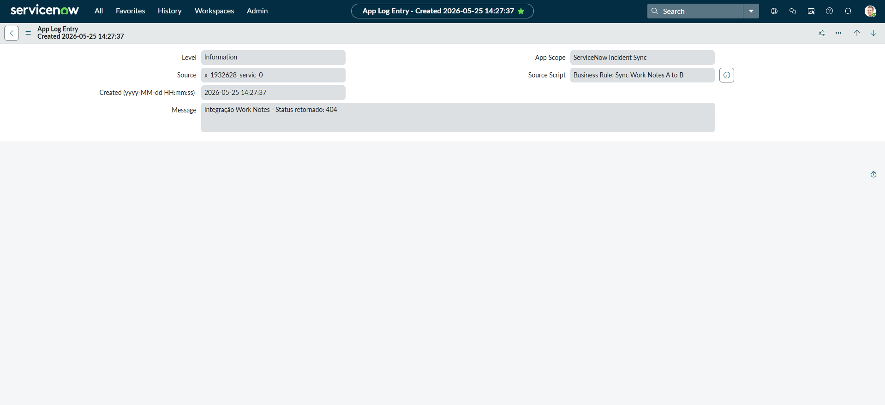

# servicenow-instance-to-instance-integration
Este projeto simula uma integração de instância para instância (I2I) entre duas instâncias de desenvolvedor pessoal (PDIs) do ServiceNow. O objetivo era criar sincronização automatizada de incidentes usando APIs REST, Regras de Negócios assíncronas e campos de relacionamento personalizados.

Instance A → Source environment
Instância B → Ambiente de destino

Comunicação:
- Mensagem RESTMagseV2
- Solicitações PATCH
- Autenticação Básica
- Regras de negócios assíncronas
  
✅ Automatic incident creation

✅ Integração de saúde da API REST

✅ Autenticação básica de autenticação

✅ Regras de negócios assíncronas

✅ Campo de relacionamento de ID de sistema externo

✅ Testes de sincronização de notas de trabalho

✅ Tratamento de privilégios entre escopos

✅ Solução de problemas de erros HTTP

Main challenges faced during development:

- Recursive Business Rule loops
- HTTP 401/403/404 troubleshooting
- Journal Field behavior
- Scoped vs Global conflicts
- Instance instability caused by improper update logic

One recursive loop caused the entire instance to become unstable, requiring debugging and recovery actions.

- ServiceNow
- JavaScript
- REST API
- RESTMessageV2
- GlideRecord
- Business Rules
- ITSM

## Screenshots

### Incident synchronization between instances

### Incident list overview

### Integration application logs

